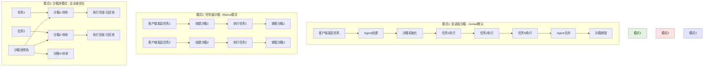
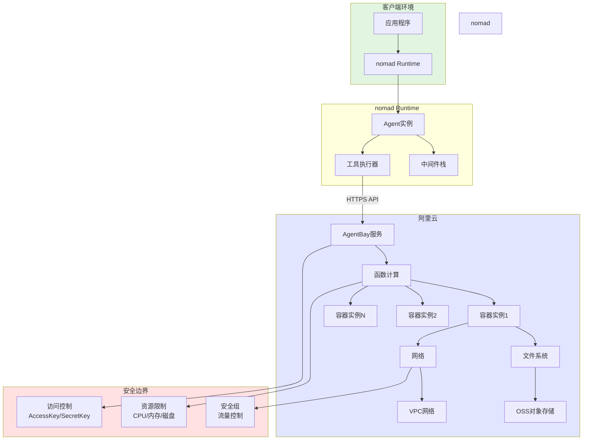
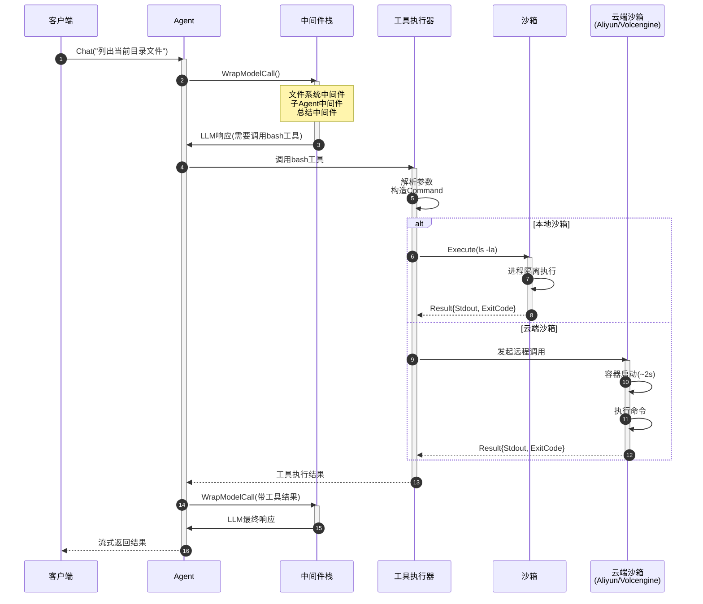
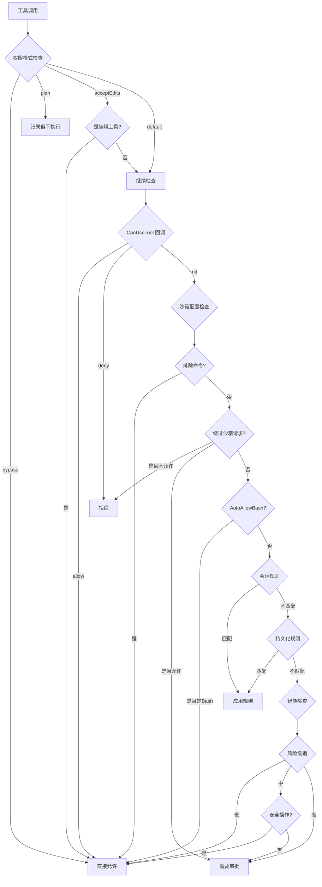

# 沙箱系统

nomad的沙箱系统提供安全隔离的代码执行环境，确保Agent执行的命令不会危害主机系统。本系统参考 Claude Agent SDK 设计，提供细粒度的权限控制和安全策略。

## 🆕 Claude Agent SDK 风格增强

nomad 1.x 版本引入了与 Claude Agent SDK 对齐的沙箱和权限系统：

- **SandboxSettings**: 细粒度沙箱安全配置
- **CanUseTool 回调**: 自定义权限检查逻辑
- **权限模式**: default、acceptEdits、bypassPermissions、plan
- **网络隔离**: 主机白名单/黑名单、Unix Socket 控制
- **违规忽略**: 按模式忽略特定文件/网络违规
- **动态权限更新**: 会话级和持久化规则管理

## 🛡️ 为什么需要沙箱？

### 安全风险

Agent可能会：

- 执行危险命令（`rm -rf /`）
- 访问敏感文件
- 发起网络攻击
- 消耗过多资源

### 沙箱的作用

```
┌────────────────────────────────────┐
│         主机系统                    │
│  ┌──────────────────────────────┐  │
│  │      nomad Runtime        │  │
│  │                              │  │
│  │  ┌────────────────────────┐  │  │
│  │  │     Sandbox            │  │  │
│  │  │  ┌──────────────────┐  │  │  │
│  │  │  │  Agent执行代码    │  │  │  │
│  │  │  │  (隔离环境)       │  │  │  │
│  │  │  └──────────────────┘  │  │  │
│  │  │  - 限制文件访问        │  │  │
│  │  │  - 限制网络访问        │  │  │
│  │  │  - 限制资源使用        │  │  │
│  │  └────────────────────────┘  │  │
│  └──────────────────────────────┘  │
└────────────────────────────────────┘
```

## 🔄 沙箱生命周期与执行模式

### 生命周期流程图

nomad支持三种沙箱执行模式，满足不同场景需求：



### 执行模式对比

| 模式       | 沙箱生命周期   | 适用场景               | 优点                              | 缺点                      |
| ---------- | -------------- | ---------------------- | --------------------------------- | ------------------------- |
| **会话级** | Agent创建→关闭 | 长对话、状态保留       | 无重复创建开销<br/>保留执行上下文 | 长期占用资源              |
| **任务级** | 每个任务独立   | 高安全要求、无状态任务 | 完全隔离<br/>无状态污染           | 冷启动延迟<br/>成本较高   |
| **沙箱池** | 预热+复用      | 高并发、低延迟         | 极低延迟<br/>资源利用率高         | 需要状态清理<br/>管理复杂 |

## 📦 沙箱类型

nomad支持多种沙箱后端：

| 沙箱类型              | 隔离级别 | 使用场景 | 性能 | 成本   |
| --------------------- | -------- | -------- | ---- | ------ |
| **LocalSandbox**      | 进程级   | 开发测试 | 高   | 免费   |
| **AliyunSandbox**     | 容器级   | 生产环境 | 中   | 按用量 |
| **VolcengineSandbox** | 容器级   | 生产环境 | 高   | 按用量 |
| **MockSandbox**       | 无隔离   | 单元测试 | 极高 | 免费   |

## 🏠 LocalSandbox

### 特点

- 在本地进程或Docker容器中执行
- 适合开发和测试
- 低延迟、高性能
- 免费使用

### 配置

```go
ag, err := agent.Create(ctx, &types.AgentConfig{
    Sandbox: &types.SandboxConfig{
        Kind:    types.SandboxKindLocal,
        WorkDir: "./workspace",
    },
}, deps)
```

### Docker模式

```go
ag, err := agent.Create(ctx, &types.AgentConfig{
    Sandbox: &types.SandboxConfig{
        Kind:    types.SandboxKindLocal,
        WorkDir: "/workspace",
        Config: map[string]interface{}{
            "use_docker": true,
            "image":      "golang:1.21",
            "memory":     "512m",
            "cpu":        "1.0",
        },
    },
}, deps)
```

### 限制

- 依赖主机环境
- 隔离性较弱
- 不适合生产环境
- 需要手动管理清理

## ☁️ AliyunSandbox

### 特点

- 阿里云AgentBay Computer Use
- 容器级隔离
- 按需付费
- 自动扩缩容
- 生产级稳定性

### 开通服务

1. 访问[阿里云AgentBay](https://www.aliyun.com/product/agentbay)
2. 开通服务
3. 获取AccessKey和SecretKey

### 配置

```go
ag, err := agent.Create(ctx, &types.AgentConfig{
    Sandbox: &types.SandboxConfig{
        Kind:    types.SandboxKindAliyun,
        WorkDir: "/workspace",
        Config: map[string]interface{}{
            "region":     "cn-hangzhou",
            "access_key": os.Getenv("ALIYUN_ACCESS_KEY_ID"),
            "secret_key": os.Getenv("ALIYUN_ACCESS_KEY_SECRET"),

            // 可选配置
            "timeout":       300,        // 超时时间（秒）
            "memory_limit":  1024,       // 内存限制（MB）
            "cpu_limit":     2.0,        // CPU限制（核心数）
            "network_mode":  "restricted", // 网络模式
        },
    },
}, deps)
```

### 环境变量配置

```bash
# .env文件
export ALIYUN_ACCESS_KEY_ID="your-access-key"
export ALIYUN_ACCESS_KEY_SECRET="your-secret-key"
export ALIYUN_REGION="cn-hangzhou"
```

### 费用说明

- 按执行时间计费
- 约￥0.01/秒（取决于资源配置）
- 有免费额度（新用户）

### 架构集成图



### 数据流说明

1. **客户端 → nomad**：应用程序通过SDK发起Agent调用
2. **nomad → 阿里云**：通过HTTPS API调用AgentBay服务
3. **AgentBay → 函数计算**：动态创建或分配容器实例
4. **容器执行**：在隔离环境中执行命令，访问受限资源
5. **结果返回**：执行结果通过API返回到nomad

## 🌋 VolcengineSandbox

### 特点

- 火山引擎云沙箱
- 高性能计算
- 容器级隔离
- 按需付费

### 开通服务

1. 访问[火山引擎](https://www.volcengine.com/)
2. 开通沙箱服务
3. 获取AK/SK

### 配置

```go
ag, err := agent.Create(ctx, &types.AgentConfig{
    Sandbox: &types.SandboxConfig{
        Kind:    types.SandboxKindVolcengine,
        WorkDir: "/workspace",
        Config: map[string]interface{}{
            "region":           "cn-beijing",
            "access_key_id":    os.Getenv("VOLC_ACCESS_KEY_ID"),
            "secret_access_key": os.Getenv("VOLC_SECRET_ACCESS_KEY"),

            // 可选配置
            "instance_type": "standard",  // standard/performance
            "timeout":       600,
            "auto_destroy":  true,
        },
    },
}, deps)
```

## 🧪 MockSandbox

### 特点

- 模拟执行，不实际运行
- 用于单元测试
- 无副作用
- 可预设返回值

### 配置

```go
mockSandbox := sandbox.NewMockSandbox()

// 预设命令返回
mockSandbox.SetOutput("ls", "file1.txt\nfile2.txt\n")
mockSandbox.SetOutput("cat README.md", "# Hello\n...")

ag, err := agent.Create(ctx, &types.AgentConfig{
    Sandbox: &types.SandboxConfig{
        Kind: types.SandboxKindMock,
    },
}, &agent.Dependencies{
    SandboxFactory: func() sandbox.Sandbox {
        return mockSandbox
    },
    // ...
})
```

### 测试示例

```go
func TestAgentWithMockSandbox(t *testing.T) {
    mock := sandbox.NewMockSandbox()
    mock.SetOutput("go test", "PASS\nok\t...")

    ag, _ := agent.Create(ctx, config, &agent.Dependencies{
        SandboxFactory: func() sandbox.Sandbox {
            return mock
        },
    })

    result, _ := ag.Chat(ctx, "运行测试")
    assert.Contains(t, result.Text, "测试通过")
}
```

## ⏱️ 任务执行时序图

下图展示了从客户端发起请求到沙箱执行完成的完整交互流程：



### 关键时序节点

| 阶段          | 本地沙箱耗时 | 云端沙箱耗时 | 说明           |
| ------------- | ------------ | ------------ | -------------- |
| 1-3 LLM推理   | ~500ms       | ~500ms       | 第一次模型调用 |
| 4-6 工具准备  | ~10ms        | ~10ms        | 参数解析和验证 |
| 7-9 沙箱执行  | ~50ms        | ~2s          | 云端需要冷启动 |
| 10-12 LLM响应 | ~300ms       | ~300ms       | 第二次模型调用 |
| **总耗时**    | **~860ms**   | **~2.8s**    | -              |

### 优化建议

1. **云端沙箱预热**：提前创建沙箱实例，消除冷启动延迟
2. **并行执行**：多个独立命令可并行调用沙箱
3. **结果缓存**：相同命令（如 `ls`）可缓存结果
4. **沙箱池**：高并发场景使用沙箱池降低平均延迟

## 🔐 SandboxSettings 配置

### 完整配置示例

```go
sandboxSettings := &types.SandboxSettings{
    // 启用沙箱隔离
    Enabled: true,

    // 沙箱启用时自动批准 bash 命令
    AutoAllowBashIfSandboxed: true,

    // 静态白名单，这些命令绕过沙箱限制
    ExcludedCommands: []string{"git", "docker"},

    // 允许模型请求绕过沙箱（需要权限审批）
    AllowUnsandboxedCommands: true,

    // 网络沙箱配置
    Network: &types.NetworkSandboxSettings{
        AllowLocalBinding:   true,                             // 允许绑定本地端口
        AllowUnixSockets:    []string{"/var/run/docker.sock"}, // 允许的 Unix Socket
        AllowAllUnixSockets: false,                            // 不允许所有 Socket
        AllowedHosts:        []string{"api.openai.com", "api.anthropic.com"},
        BlockedHosts:        []string{"malicious.com"},
        HTTPProxyPort:       8080,
        SOCKSProxyPort:      1080,
    },

    // 忽略特定违规
    IgnoreViolations: &types.SandboxIgnoreViolations{
        FilePatterns:    []string{"/tmp/*", "*.log"},
        NetworkPatterns: []string{"localhost:*", "127.0.0.1:*"},
    },

    // 启用较弱的嵌套沙箱（兼容性）
    EnableWeakerNestedSandbox: false,
}

sandboxConfig := &types.SandboxConfig{
    Kind:           types.SandboxKindLocal,
    WorkDir:        "./workspace",
    Settings:       sandboxSettings,
    PermissionMode: types.SandboxPermissionDefault,
}
```

### 配置字段说明

| 字段 | 类型 | 说明 |
|------|------|------|
| `Enabled` | bool | 是否启用沙箱隔离 |
| `AutoAllowBashIfSandboxed` | bool | 沙箱启用时自动批准 bash 命令 |
| `ExcludedCommands` | []string | 绕过沙箱的命令白名单 |
| `AllowUnsandboxedCommands` | bool | 允许模型请求绕过沙箱 |
| `Network` | *NetworkSandboxSettings | 网络隔离配置 |
| `IgnoreViolations` | *SandboxIgnoreViolations | 忽略的违规模式 |

### 网络沙箱配置

```go
type NetworkSandboxSettings struct {
    AllowLocalBinding   bool     // 允许绑定本地端口（开发服务器）
    AllowUnixSockets    []string // 允许的 Unix Socket 路径
    AllowAllUnixSockets bool     // 允许所有 Unix Socket
    HTTPProxyPort       int      // HTTP 代理端口
    SOCKSProxyPort      int      // SOCKS 代理端口
    AllowedHosts        []string // 允许访问的主机
    BlockedHosts        []string // 禁止访问的主机
}
```

## 🎛️ 权限模式 (SandboxPermissionMode)

nomad 支持四种权限模式，对应不同的安全级别：

| 模式 | 常量 | 说明 |
|------|------|------|
| **默认** | `SandboxPermissionDefault` | 标准权限检查流程 |
| **接受编辑** | `SandboxPermissionAcceptEdits` | 自动接受文件编辑操作 |
| **绕过权限** | `SandboxPermissionBypass` | 绕过所有权限检查（危险） |
| **规划模式** | `SandboxPermissionPlan` | 只记录不执行，用于预览 |

```go
// 设置权限模式
sandboxConfig := &types.SandboxConfig{
    Kind:           types.SandboxKindLocal,
    PermissionMode: types.SandboxPermissionAcceptEdits, // 自动接受编辑
}
```

## 🔄 CanUseTool 回调

`CanUseTool` 是 Claude Agent SDK 风格的自定义权限检查回调，允许应用层完全控制工具权限。

### 回调签名

```go
type CanUseToolFunc func(
    ctx context.Context,
    toolName string,
    input map[string]any,
    opts *CanUseToolOptions,
) (*PermissionResult, error)
```

### 回调选项

```go
type CanUseToolOptions struct {
    Signal                 context.Context // 取消信号
    Suggestions            []PermissionUpdate // 建议的权限更新
    SandboxEnabled         bool // 沙箱是否启用
    BypassSandboxRequested bool // 是否请求绕过沙箱
}
```

### 返回结果

```go
type PermissionResult struct {
    Behavior           string            // "allow" | "deny"
    UpdatedInput       map[string]any    // 修改后的输入参数
    UpdatedPermissions []PermissionUpdate // 权限更新操作
    Message            string            // 拒绝原因
    Interrupt          bool              // 是否中断执行
}
```

### 使用示例

```go
canUseTool := func(
    ctx context.Context,
    toolName string,
    input map[string]any,
    opts *types.CanUseToolOptions,
) (*types.PermissionResult, error) {
    // 1. 阻止访问敏感文件
    if path, ok := input["path"].(string); ok {
        if path == "/etc/passwd" || path == "/etc/shadow" {
            return &types.PermissionResult{
                Behavior: "deny",
                Message:  "Access to system files is not allowed",
            }, nil
        }
    }

    // 2. 自动批准读操作
    if toolName == "Read" || toolName == "Glob" {
        return &types.PermissionResult{Behavior: "allow"}, nil
    }

    // 3. 修改输入参数（添加超时）
    if toolName == "Bash" {
        input["timeout"] = 30000
        return &types.PermissionResult{
            Behavior:     "allow",
            UpdatedInput: input,
        }, nil
    }

    // 4. 添加会话级规则
    if toolName == "Write" {
        return &types.PermissionResult{
            Behavior: "allow",
            UpdatedPermissions: []types.PermissionUpdate{
                {
                    Type:        "addRules",
                    Behavior:    "allow",
                    Destination: "session",
                    Rules: []types.PermissionRule{
                        {ToolName: "Write", RuleContent: "auto-approved"},
                    },
                },
            },
        }, nil
    }

    // 5. 返回 nil 让权限系统决策
    return nil, nil
}

// 在 AgentConfig 中使用
agentConfig := &types.AgentConfig{
    CanUseTool: canUseTool,
    // ...
}
```

## 🛡️ EnhancedInspector 权限检查器

`EnhancedInspector` 是增强版权限检查器，整合了 CanUseTool 回调、沙箱配置和规则管理。

### 创建检查器

```go
inspector := permission.NewEnhancedInspector(&permission.EnhancedInspectorConfig{
    Mode:          permission.ModeSmartApprove,
    SandboxConfig: sandboxConfig,
    CanUseTool:    canUseTool,
    PersistPath:   ".nomad/permissions.json",
    AutoLoad:      true,
})
```

### 权限检查流程



### 检查结果

```go
type CheckResult struct {
    Allowed         bool                              // 是否允许
    NeedsApproval   bool                              // 是否需要审批
    DecidedBy       string                            // 决策来源
    Message         string                            // 消息
    Interrupt       bool                              // 是否中断
    UpdatedInput    map[string]any                    // 修改后的输入
    ApprovalRequest *types.ControlPermissionRequiredEvent // 审批请求
}
```

### 违规记录

```go
// 记录违规
inspector.RecordViolation(types.SandboxViolation{
    Type:      "file",
    Path:      "/etc/passwd",
    Operation: "read",
    Blocked:   true,
    Timestamp: time.Now().Unix(),
    Details:   "Attempted to read system file",
})

// 获取违规记录
violations := inspector.GetViolations()
```

## ⚠️ dangerouslyDisableSandbox 机制

模型可以在工具输入中请求绕过沙箱：

```go
// 工具调用参数
{
    "command": "sudo apt update",
    "dangerouslyDisableSandbox": true
}
```

处理流程：

1. 检查 `AllowUnsandboxedCommands` 配置
2. 如果不允许，直接拒绝
3. 如果允许，提升风险级别，需要用户审批

```go
// 配置允许绕过请求
sandboxSettings := &types.SandboxSettings{
    AllowUnsandboxedCommands: true, // 允许请求，但需要审批
}
```

## 🔧 Sandbox接口

### 接口定义

```go
type Sandbox interface {
    // 执行命令
    Execute(ctx context.Context, cmd *Command) (*Result, error)

    // 文件操作
    ReadFile(ctx context.Context, path string) ([]byte, error)
    WriteFile(ctx context.Context, path string, content []byte) error
    ListFiles(ctx context.Context, path string) ([]FileInfo, error)

    // 生命周期
    Start(ctx context.Context) error
    Stop(ctx context.Context) error
    Health(ctx context.Context) error
}
```

### Command结构

```go
type Command struct {
    Command     string            // 命令字符串
    Args        []string          // 参数
    Env         map[string]string // 环境变量
    WorkDir     string            // 工作目录
    Timeout     time.Duration     // 超时时间
    StdinData   []byte            // 标准输入
}
```

### Result结构

```go
type Result struct {
    Stdout   string // 标准输出
    Stderr   string // 标准错误
    ExitCode int    // 退出码
    Duration time.Duration // 执行时长
    Error    error  // 错误（如有）
}
```

## 🎯 使用场景

### 场景1：代码执行

```go
// Agent执行bash命令
ag.Chat(ctx, `
运行以下Go程序：
go run main.go

然后告诉我输出是什么
`)
```

沙箱中执行：

```bash
$ go run main.go
Hello, World!
```

### 场景2：文件操作

```go
// Agent操作文件
ag.Chat(ctx, `
1. 创建一个hello.txt文件
2. 写入"Hello nomad"
3. 读取并验证内容
`)
```

沙箱操作：

```bash
$ echo "Hello nomad" > /workspace/hello.txt
$ cat /workspace/hello.txt
Hello nomad
```

### 场景3：依赖安装

```go
// Agent安装依赖
ag.Chat(ctx, `
安装所需的Python包：
pip install requests beautifulsoup4

然后运行scraper.py
`)
```

### 场景4：测试运行

```go
// Agent运行测试
ag.Chat(ctx, `
运行所有单元测试：
go test ./...

如果有失败，分析原因
`)
```

## ⚙️ 高级配置

### 资源限制

```go
Sandbox: &types.SandboxConfig{
    Kind: types.SandboxKindAliyun,
    Config: map[string]interface{}{
        // CPU限制
        "cpu_limit": 2.0,  // 2个CPU核心
        "cpu_request": 1.0, // 请求1个核心

        // 内存限制
        "memory_limit": 2048,  // 2GB
        "memory_request": 1024, // 请求1GB

        // 磁盘限制
        "disk_limit": 10240,  // 10GB

        // 超时限制
        "timeout": 600,  // 10分钟
        "idle_timeout": 300,  // 空闲5分钟自动销毁
    },
}
```

### 网络配置

```go
Config: map[string]interface{}{
    // 网络模式
    "network_mode": "restricted",  // none/restricted/full

    // 允许的域名白名单
    "allowed_domains": []string{
        "api.github.com",
        "registry.npmjs.org",
    },

    // 禁止的域名黑名单
    "blocked_domains": []string{
        "*.internal.com",
    },

    // 代理配置
    "http_proxy": "http://proxy.example.com:8080",
}
```

### 持久化存储

```go
Config: map[string]interface{}{
    // 挂载卷
    "volumes": []map[string]string{
        {
            "source": "/host/data",
            "target": "/workspace/data",
            "readonly": false,
        },
    },

    // 状态持久化
    "persistent_volume": "/mnt/agent-state",
    "restore_on_start": true,
}
```

### 镜像配置

```go
Config: map[string]interface{}{
    // 自定义镜像
    "image": "my-registry.com/agent-runtime:v1.0",

    // 镜像拉取策略
    "image_pull_policy": "IfNotPresent",  // Always/IfNotPresent/Never

    // 镜像凭据
    "image_pull_secrets": []string{"my-registry-secret"},
}
```

## 🔒 安全策略

### 文件系统隔离

```go
Config: map[string]interface{}{
    // 只读挂载
    "readonly_paths": []string{
        "/etc",
        "/usr",
    },

    // 禁止访问
    "blocked_paths": []string{
        "/proc",
        "/sys",
    },

    // 临时目录
    "temp_dir": "/tmp/agent",
    "auto_clean_temp": true,
}
```

### 命令白名单

```go
Config: map[string]interface{}{
    // 允许的命令
    "allowed_commands": []string{
        "ls", "cat", "echo",
        "go", "python3", "node",
        "git", "npm", "pip",
    },

    // 禁止的命令
    "blocked_commands": []string{
        "rm", "dd", "mkfs",
        "sudo", "su",
    },
}
```

### 环境变量过滤

```go
Config: map[string]interface{}{
    // 允许传递的环境变量
    "env_whitelist": []string{
        "PATH",
        "HOME",
        "LANG",
    },

    // 禁止的环境变量
    "env_blacklist": []string{
        "AWS_*",
        "GITHUB_TOKEN",
    },
}
```

## 📊 监控和日志

### 执行日志

```go
// 订阅Monitor通道获取沙箱事件
monitorCh := ag.Subscribe([]types.AgentChannel{
    types.ChannelMonitor,
}, nil)

for envelope := range monitorCh {
    if e, ok := envelope.Event.(*types.MonitorSandboxExecutionEvent); ok {
        log.Printf("沙箱执行: Command=%s Duration=%v ExitCode=%d",
            e.Command, e.Duration, e.ExitCode)
    }
}
```

### 资源监控

```go
type MonitorSandboxResourceEvent struct {
    CPUUsage    float64  // CPU使用率
    MemoryUsage int64    // 内存使用（字节）
    DiskUsage   int64    // 磁盘使用（字节）
    NetworkIn   int64    // 网络入（字节）
    NetworkOut  int64    // 网络出（字节）
}
```

### 告警配置

```go
Config: map[string]interface{}{
    // 资源告警阈值
    "alert_cpu_threshold": 80.0,     // CPU使用率超过80%
    "alert_memory_threshold": 90.0,   // 内存使用率超过90%
    "alert_disk_threshold": 95.0,     // 磁盘使用率超过95%

    // 告警回调
    "alert_webhook": "https://alerts.example.com/webhook",
}
```

## 🎯 最佳实践

### 1. 选择合适的沙箱

```go
// 开发环境
if os.Getenv("ENV") == "development" {
    sandboxKind = types.SandboxKindLocal
}

// 测试环境
if os.Getenv("ENV") == "test" {
    sandboxKind = types.SandboxKindMock
}

// 生产环境
if os.Getenv("ENV") == "production" {
    sandboxKind = types.SandboxKindAliyun
}
```

### 2. 设置合理的超时

```go
Config: map[string]interface{}{
    // 短任务
    "timeout": 30,  // 30秒

    // 长任务（编译、测试）
    "timeout": 600,  // 10分钟

    // 批量处理
    "timeout": 3600,  // 1小时
}
```

### 3. 清理临时文件

```go
Config: map[string]interface{}{
    "auto_clean": true,
    "clean_on_stop": true,
    "max_disk_usage": 5 * 1024 * 1024 * 1024,  // 5GB
}
```

### 4. 错误处理

```go
result, err := sandbox.Execute(ctx, cmd)
if err != nil {
    // 检查错误类型
    if errors.Is(err, context.DeadlineExceeded) {
        log.Println("命令超时")
    } else if errors.Is(err, sandbox.ErrResourceLimit) {
        log.Println("资源限制")
    } else {
        log.Printf("执行失败: %v", err)
    }
    return err
}

// 检查退出码
if result.ExitCode != 0 {
    log.Printf("命令失败: %s", result.Stderr)
}
```

### 5. 性能优化

```go
// 复用沙箱实例
type SandboxPool struct {
    pool chan sandbox.Sandbox
}

func (p *SandboxPool) Get() sandbox.Sandbox {
    select {
    case sb := <-p.pool:
        return sb
    default:
        return sandbox.New()
    }
}

func (p *SandboxPool) Put(sb sandbox.Sandbox) {
    select {
    case p.pool <- sb:
    default:
        sb.Stop(context.Background())
    }
}
```

## 📝 完整示例

### 沙箱权限演示

```go
package main

import (
    "context"
    "fmt"

    "github.com/nabob-ai/nomad/pkg/agent"
    "github.com/nabob-ai/nomad/pkg/permission"
    "github.com/nabob-ai/nomad/pkg/types"
)

func main() {
    ctx := context.Background()

    // 1. 配置沙箱设置
    sandboxSettings := &types.SandboxSettings{
        Enabled:                  true,
        AutoAllowBashIfSandboxed: true,
        ExcludedCommands:         []string{"git", "docker"},
        AllowUnsandboxedCommands: true,
        Network: &types.NetworkSandboxSettings{
            AllowLocalBinding: true,
            AllowedHosts:      []string{"api.openai.com"},
        },
        IgnoreViolations: &types.SandboxIgnoreViolations{
            FilePatterns: []string{"/tmp/*"},
        },
    }

    sandboxConfig := &types.SandboxConfig{
        Kind:           types.SandboxKindLocal,
        WorkDir:        "./workspace",
        Settings:       sandboxSettings,
        PermissionMode: types.SandboxPermissionDefault,
    }

    // 2. 自定义权限回调
    canUseTool := func(
        ctx context.Context,
        toolName string,
        input map[string]any,
        opts *types.CanUseToolOptions,
    ) (*types.PermissionResult, error) {
        // 阻止敏感文件访问
        if path, ok := input["path"].(string); ok {
            if path == "/etc/passwd" {
                return &types.PermissionResult{
                    Behavior: "deny",
                    Message:  "Access denied",
                }, nil
            }
        }
        return nil, nil
    }

    // 3. 创建权限检查器
    inspector := permission.NewEnhancedInspector(&permission.EnhancedInspectorConfig{
        Mode:          permission.ModeSmartApprove,
        SandboxConfig: sandboxConfig,
        CanUseTool:    canUseTool,
    })

    // 4. 测试权限检查
    call := &types.ToolCallSnapshot{
        ID:        "test-1",
        Name:      "Read",
        Arguments: map[string]any{"path": "README.md"},
    }

    result, _ := inspector.Check(ctx, call)
    fmt.Printf("Allowed: %v, DecidedBy: %s\n", result.Allowed, result.DecidedBy)
}
```

运行示例：

```bash
go run examples/sandbox-permission/main.go -api-key $ANTHROPIC_API_KEY
```

## 📚 下一步

- [Agent生命周期](/core-concepts/agent-lifecycle) - 理解沙箱在Agent生命周期中的作用
- [工具系统](/core-concepts/tools-system) - 理解工具如何使用沙箱
- [权限系统](/core-concepts/permission) - 深入了解权限检查机制
- [实战指南](/guides/sandbox-setup) - 沙箱配置和使用示例
- [API参考](/api-reference/sandbox-api) - 详细的Sandbox API文档

## 🔗 相关资源

- [Claude Agent SDK](https://github.com/anthropics/anthropic-sdk-python) - 参考实现
- [阿里云AgentBay文档](https://help.aliyun.com/product/agentbay.html)
- [火山引擎沙箱文档](https://www.volcengine.com/docs/sandbox)
- [沙箱示例代码](https://github.com/nabob-ai/nomad/tree/main/examples/sandbox-permission)
