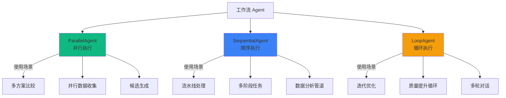
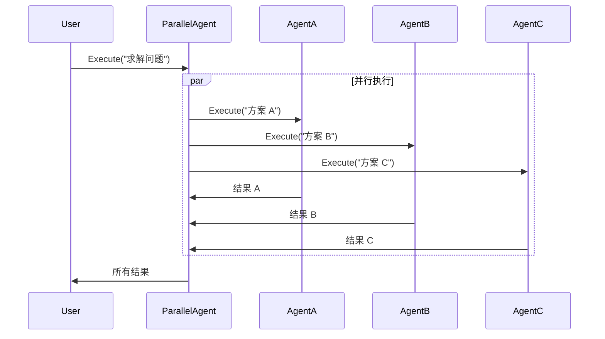
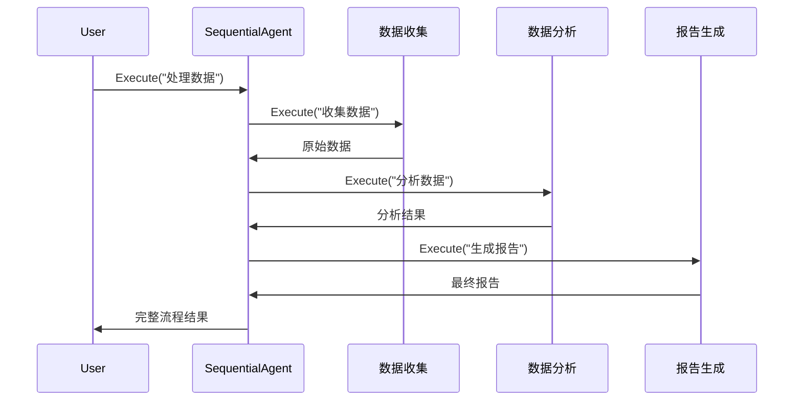
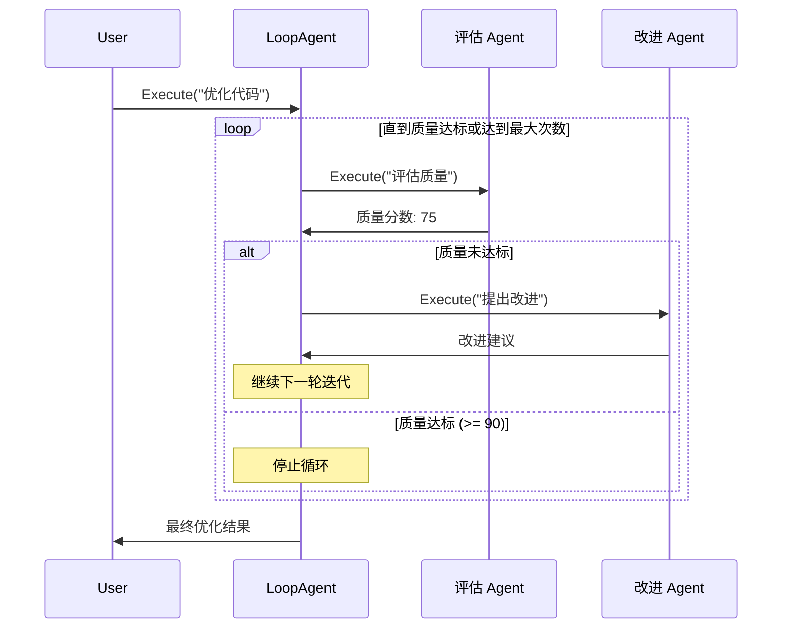
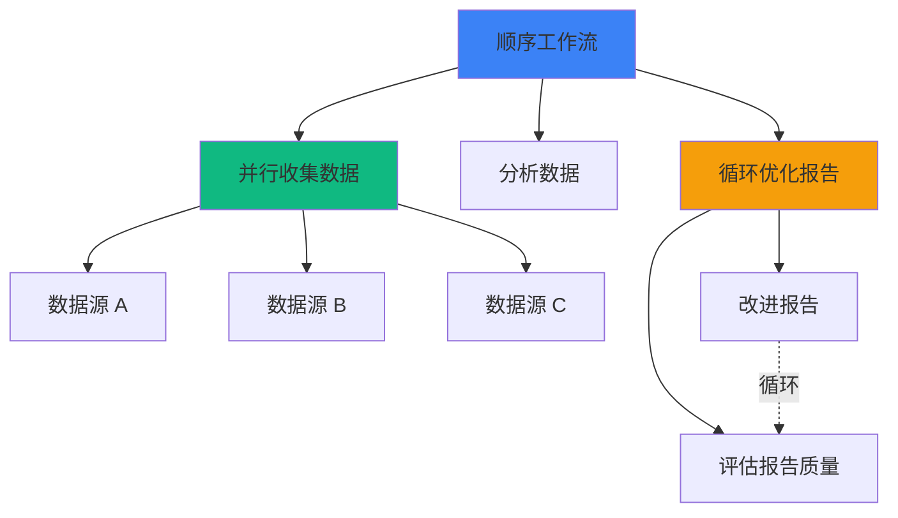

# 工作流 Agent

工作流 Agent 是 nomad Phase 7 引入的核心功能，用于编排多个子 Agent 的执行流程。基于 Google ADK-Go 的设计，使用 `stream.Reader` 实现高效的流式处理。

## 🎯 设计理念

### 为什么需要工作流 Agent？

在复杂的 AI 任务中，单个 Agent 往往难以处理所有场景。工作流 Agent 提供了结构化的编排能力，将大任务分解为多个小任务，由专门的子 Agent 协作完成。

**优势**:

- ✅ **模块化**: 每个子 Agent 专注于特定任务
- ✅ **可复用**: 子 Agent 可在不同工作流中重用
- ✅ **可维护**: 工作流结构清晰，易于调试
- ✅ **高性能**: 基于 stream.Reader，内存占用 O(1)

## 📊 三种工作流模式



### ParallelAgent - 并行执行

同时执行多个子 Agent，收集所有结果。



**特点**:

- 使用 `errgroup` 管理并发
- 所有子 Agent 同时启动
- 事件返回顺序不确定（取决于完成时间）
- 任一子 Agent 错误会传播给调用者

**使用场景**:

- 多个算法同时运行，选择最佳结果
- 从多个数据源并行获取数据
- 生成多个候选方案供用户选择

### SequentialAgent - 顺序执行

按顺序依次执行子 Agent，前一步的输出可作为后一步的上下文。



**特点**:

- 严格按顺序执行
- 前一步失败则整个流程终止
- 每步的事件都包含步骤信息（`sequential_step`）
- 实际上是 `LoopAgent(MaxIterations=1)` 的特例

**使用场景**:

- 数据处理流水线
- 多阶段决策流程
- 需求分析 → 方案设计 → 代码实现

### LoopAgent - 循环执行

重复执行子 Agent 直到满足终止条件或达到最大迭代次数。



**特点**:

- 支持自定义停止条件 (`StopCondition`)
- 支持最大迭代次数限制 (`MaxIterations`)
- 每个事件包含迭代信息（`loop_iteration`）
- 必须设置 `MaxIterations` 或 `StopCondition` 之一

**使用场景**:

- 代码质量优化循环
- 多轮对话直到用户满意
- 任务重试直到成功

## 🏗️ 架构设计

### Agent 接口

所有工作流 Agent 都实现统一的接口：

```go
type Agent interface {
    Name() string
    Execute(ctx context.Context, message string) *stream.Reader[*session.Event]
}
```

**关键特性**:

- 使用 `stream.Reader` 实现流式接口
- 内存占用 O(1) vs 传统 O(n)
- 支持取消和超时（通过 `context.Context`）
- 通过 `Recv()` 返回 `(event, error)` 元组，支持错误传播

### 事件流

工作流 Agent 会丰富事件元数据：

```go
type Event struct {
    ID           string
    Timestamp    time.Time
    AgentID      string
    Branch       string                 // 事件来源路径
    Content      types.Message
    Actions      types.EventActions
    Metadata     map[string]interface{} // 工作流元数据
}
```

**元数据字段**:

| 字段               | 类型   | 说明                                | 示例                        |
| ------------------ | ------ | ----------------------------------- | --------------------------- |
| `branch`           | string | 事件来源路径                        | `"Pipeline.Analyzer.iter1"` |
| `parallel_index`   | int    | ParallelAgent 子 Agent 索引         | `0, 1, 2`                   |
| `parallel_agent`   | string | ParallelAgent 名称                  | `"MultiAlgorithm"`          |
| `sequential_step`  | int    | SequentialAgent 当前步骤（1-based） | `2`                         |
| `total_steps`      | int    | SequentialAgent 总步骤数            | `3`                         |
| `sequential_agent` | string | SequentialAgent 名称                | `"DataPipeline"`            |
| `loop_iteration`   | uint   | LoopAgent 当前迭代（0-based）       | `1`                         |
| `loop_agent`       | string | LoopAgent 名称                      | `"OptimizationLoop"`        |
| `sub_agent_index`  | int    | 子 Agent 在列表中的索引             | `0`                         |

## 🔄 嵌套工作流

工作流 Agent 支持嵌套使用，构建复杂的多层级编排：



**示例代码**:

```go
// 第一层：并行收集
parallelCollector, _ := workflow.NewParallelAgent(workflow.ParallelConfig{
    Name: "ParallelCollector",
    SubAgents: []workflow.Agent{
        NewDataSourceAgent("Source1"),
        NewDataSourceAgent("Source2"),
        NewDataSourceAgent("Source3"),
    },
})

// 第二层：顺序执行（包含嵌套的并行流程）
nestedWorkflow, _ := workflow.NewSequentialAgent(workflow.SequentialConfig{
    Name: "NestedWorkflow",
    SubAgents: []workflow.Agent{
        parallelCollector, // 并行收集
        analyzer,          // 串行分析
        reporter,          // 串行报告
    },
})
```

## 🎓 最佳实践

### 1. 选择合适的工作流模式

| 场景             | 推荐模式              | 原因                             |
| ---------------- | --------------------- | -------------------------------- |
| 需要比较多个方案 | ParallelAgent         | 同时评估，节省时间               |
| 步骤间有依赖关系 | SequentialAgent       | 保证顺序，前一步输出传递给下一步 |
| 需要迭代改进     | LoopAgent             | 循环优化直到满足条件             |
| 先并行后串行     | Sequential + Parallel | 嵌套工作流                       |

### 2. 流式处理最佳实践

```go
// ✅ 推荐：使用 stream.Reader 流式处理
reader := workflow.Execute(ctx, msg)
for {
    event, err := reader.Recv()
    if err != nil {
        if errors.Is(err, io.EOF) {
            break
        }
        log.Printf("错误: %v", err)
        continue
    }
    // 实时处理事件，内存占用 O(1)
    handleEvent(event)
}

// ❌ 避免：收集所有结果再处理
var results []Event
reader := workflow.Execute(ctx, msg)
for {
    event, err := reader.Recv()
    if err != nil {
        if errors.Is(err, io.EOF) {
            break
        }
        continue
    }
    results = append(results, event)  // 内存占用 O(n)
}
// 然后处理 results...
```

### 3. 错误处理策略

```go
reader := sequential.Execute(ctx, "任务")
for {
    event, err := reader.Recv()
    if err != nil {
        if errors.Is(err, io.EOF) {
            break
        }
        // 记录错误
        log.Printf("错误: %v", err)

        // 根据业务决定是否继续
        if isCriticalError(err) {
            break  // 中断工作流
        }
        continue  // 继续处理下一个事件
    }

    // 处理正常事件
    processEvent(event)
}
```

### 4. 上下文取消和超时

```go
// 设置超时
ctx, cancel := context.WithTimeout(context.Background(), 5*time.Minute)
defer cancel()

// 执行工作流
reader := workflow.Execute(ctx, "任务")
for {
    event, err := reader.Recv()
    if err != nil {
        if errors.Is(err, io.EOF) {
            break
        }
        continue
    }

    // 检查上下文取消
    if ctx.Err() != nil {
        fmt.Println("工作流被取消或超时")
        break
    }

    // 处理事件
    handleEvent(event)
}
```

### 5. 停止条件设计

```go
// 方式1: 基于质量分数
StopCondition: func(event *session.Event) bool {
    return event.Metadata["quality_score"].(int) >= 90
}

// 方式2: 基于错误检测
StopCondition: func(event *session.Event) bool {
    return event.Metadata["error_count"].(int) == 0
}

// 方式3: 组合条件
StopCondition: func(event *session.Event) bool {
    score := event.Metadata["quality_score"].(int)
    attempts := event.Metadata["attempts"].(int)
    // 质量达标或尝试次数过多
    return score >= 90 || attempts >= 10
}
```

## 🔗 与 ADK-Go 对齐

nomad 的工作流 Agent 设计参考了 Google ADK-Go：

| 特性                | ADK-Go | nomad | 说明                        |
| ------------------- | ------ | ----- | --------------------------- |
| **ParallelAgent**   | ✅     | ✅    | 并行执行多个子 Agent        |
| **SequentialAgent** | ✅     | ✅    | 顺序执行（LoopAgent 特例）  |
| **LoopAgent**       | ✅     | ✅    | 循环执行直到条件满足        |
| **stream.Reader**   | -      | ✅    | 高效流式接口                |
| **StopCondition**   | ✅     | ✅    | 自定义停止条件              |
| **Escalate 机制**   | ✅     | ✅    | 通过 EventActions.Escalate  |
| **Branch 追踪**     | ✅     | ✅    | event.Branch 字段           |
| **元数据丰富**      | ✅     | ✅    | 自动添加 iteration、step 等 |

**差异**:

- nomad 提供了更丰富的元数据字段
- nomad 与 Session 持久化深度集成
- nomad 支持 OpenTelemetry 分布式追踪

## 📚 相关资源

- [工作流 Agent 示例](/examples/workflow-agents) - 完整可运行示例
- [多 Agent 协作](/examples/multi-agent) - SubAgent 和 Pool 模式
- [Session 持久化](/core-concepts/session-persistence) - 工作流状态持久化
- [Google ADK-Go](https://github.com/googleapis/adk-go) - 参考实现

## ❓ 常见问题

### Q1: SequentialAgent 和 LoopAgent(MaxIterations=1) 有区别吗？

A: 没有区别。SequentialAgent 内部就是使用 `LoopAgent(MaxIterations=1)` 实现的。

### Q2: ParallelAgent 的子 Agent 执行顺序是什么？

A: 所有子 Agent 同时启动，但事件返回顺序不确定（取决于哪个 Agent 先完成）。如果需要确定顺序，使用 SequentialAgent。

### Q3: 如何避免 LoopAgent 无限循环？

A: 必须设置 `MaxIterations` 或 `StopCondition` 之一。建议同时设置两者：

```go
MaxIterations: 10,  // 最多10次迭代
StopCondition: func(event *session.Event) bool {
    return event.Metadata["success"].(bool)  // 或提前停止
}
```

### Q4: 如何调试嵌套工作流？

A: 使用 `event.Branch` 字段追踪事件来源：

```go
reader := nestedWorkflow.Execute(ctx, msg)
for {
    event, err := reader.Recv()
    if err != nil {
        if errors.Is(err, io.EOF) {
            break
        }
        continue
    }
    // Branch 示例: "Pipeline.ParallelCollector.Source1"
    fmt.Printf("[%s] %s\n", event.Branch, event.Content.Content)
}
```

### Q5: 工作流 Agent 支持持久化吗？

A: 是的，所有事件可以通过 Session 系统持久化到 PostgreSQL 或 MySQL。参见 [Session 持久化文档](/core-concepts/session-persistence)。

## 🚀 下一步

- [开始使用工作流 Agent](/examples/workflow-agents) - 完整代码示例
- [Session 持久化](/core-concepts/session-persistence) - 持久化工作流状态
- [OpenTelemetry 集成](/best-practices/monitoring) - 追踪工作流执行
- [性能优化](/best-practices/performance) - 优化工作流性能
