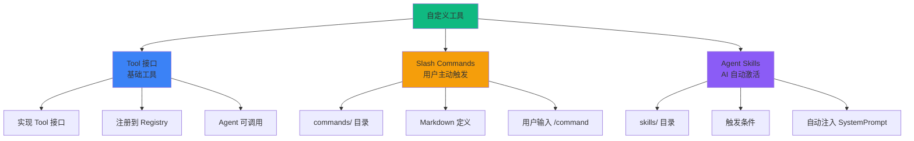

# 自定义工具示例

nomad 提供了灵活的工具扩展能力,让你可以创建适合业务需求的专用工具。本文档介绍三种自定义工具方式。

[查看完整代码 →](https://github.com/nabob-ai/nomad/blob/main/examples/skills/main.go)

## 🎯 三种自定义方式



## 🔧 方式 1: 实现 Tool 接口

最基础的方式,适合创建可复用的工具。

### 定义工具

```go
package mytools

import (
    "context"
    "fmt"

    "github.com/nabob-ai/nomad/pkg/tools"
)

// WeatherTool 天气查询工具
type WeatherTool struct {
    apiKey string
}

// NewWeatherTool 创建工具实例
func NewWeatherTool(config map[string]interface{}) (tools.Tool, error) {
    apiKey, ok := config["api_key"].(string)
    if !ok {
        return nil, fmt.Errorf("api_key is required")
    }

    return &WeatherTool{
        apiKey: apiKey,
    }, nil
}

// Name 工具名称（全局唯一）
func (t *WeatherTool) Name() string {
    return "weather"
}

// Description 工具描述（供 LLM 理解）
func (t *WeatherTool) Description() string {
    return "Get current weather information for a city. Returns temperature, condition, humidity, and wind speed."
}

// InputSchema 输入参数 Schema（JSON Schema 格式）
func (t *WeatherTool) InputSchema() map[string]interface{} {
    return map[string]interface{}{
        "type": "object",
        "properties": map[string]interface{}{
            "city": map[string]interface{}{
                "type":        "string",
                "description": "City name (e.g., 'Beijing', 'New York')",
            },
            "unit": map[string]interface{}{
                "type":        "string",
                "enum":        []string{"celsius", "fahrenheit"},
                "description": "Temperature unit (default: celsius)",
            },
        },
        "required": []string{"city"},
    }
}

// Execute 执行工具逻辑
func (t *WeatherTool) Execute(ctx context.Context, input map[string]interface{}, tc *tools.ToolContext) (interface{}, error) {
    // 1. 解析输入参数
    city, ok := input["city"].(string)
    if !ok {
        return nil, fmt.Errorf("city must be a string")
    }

    unit := "celsius"
    if u, ok := input["unit"].(string); ok {
        unit = u
    }

    // 2. 调用天气 API
    weather, err := t.fetchWeather(city, unit)
    if err != nil {
        return nil, fmt.Errorf("failed to fetch weather: %w", err)
    }

    // 3. 返回结构化结果
    return map[string]interface{}{
        "city":        city,
        "temperature": weather.Temperature,
        "unit":        unit,
        "condition":   weather.Condition,
        "humidity":    weather.Humidity,
        "wind_speed":  weather.WindSpeed,
        "updated_at":  weather.UpdatedAt,
    }, nil
}

// fetchWeather 调用天气 API
func (t *WeatherTool) fetchWeather(city, unit string) (*WeatherData, error) {
    // 实际实现：调用第三方天气 API
    // 这里返回模拟数据
    return &WeatherData{
        Temperature: 25.5,
        Condition:   "Sunny",
        Humidity:    60,
        WindSpeed:   12.3,
        UpdatedAt:   "2024-01-15 10:30:00",
    }, nil
}

type WeatherData struct {
    Temperature float64
    Condition   string
    Humidity    int
    WindSpeed   float64
    UpdatedAt   string
}
```

### 注册工具

```go
package main

import (
    "context"
    "log"
    "os"

    "your-project/mytools"
    "github.com/nabob-ai/nomad/pkg/agent"
    "github.com/nabob-ai/nomad/pkg/tools"
    "github.com/nabob-ai/nomad/pkg/types"
)

func main() {
    ctx := context.Background()

    // 1. 创建工具注册表
    toolRegistry := tools.NewRegistry()

    // 2. 注册自定义工具
    toolRegistry.Register("weather", mytools.NewWeatherTool)

    // 3. 注册 Agent 模板，声明工具可用
    templateRegistry := agent.NewTemplateRegistry()
    templateRegistry.Register(&types.AgentTemplateDefinition{
        ID:    "weather-assistant",
        Model: "claude-sonnet-4-5",
        SystemPrompt: "You are a helpful weather assistant. Use the weather tool to provide accurate weather information.",
        Tools: []interface{}{
            "weather",  // 声明可以使用 weather 工具
        },
    })

    // 4. 创建 Agent
    deps := createDependencies(toolRegistry, templateRegistry)
    config := &types.AgentConfig{
        TemplateID: "weather-assistant",
        ModelConfig: &types.ModelConfig{
            Provider: "anthropic",
            Model:    "claude-sonnet-4-5",
            APIKey:   os.Getenv("ANTHROPIC_API_KEY"),
        },
        // 传递工具配置
        ToolsConfig: map[string]interface{}{
            "weather": map[string]interface{}{
                "api_key": os.Getenv("WEATHER_API_KEY"),
            },
        },
    }

    ag, err := agent.Create(ctx, config, deps)
    if err != nil {
        log.Fatalf("Failed to create agent: %v", err)
    }
    defer ag.Close()

    // 5. 使用自定义工具
    result, _ := ag.Chat(ctx, "北京今天天气怎么样？")
    log.Printf("Assistant: %s", result.Text)
}
```

### 使用示例

```go
// Agent 会自动调用 weather 工具
ag.Chat(ctx, "北京今天天气怎么样？")
// → Tool Call: weather(city="Beijing", unit="celsius")
// → Response: "北京今天天气晴朗，温度 25.5°C，湿度 60%，风速 12.3 km/h"

ag.Chat(ctx, "纽约和东京哪个城市更热？")
// → Tool Call 1: weather(city="New York")
// → Tool Call 2: weather(city="Tokyo")
// → Response: "根据当前天气数据，纽约温度 28°C，东京温度 32°C，东京更热。"
```

## 📝 方式 2: Slash Commands

用户主动触发的命令系统，适合特定工作流。

### 命令定义格式

在 `workspace/commands/` 目录创建 Markdown 文件：

**`commands/analyze.md`:**

````markdown
---
description: 分析代码质量
argument-hint: [文件路径]
allowed-tools: ["Read", "Bash"]
models:
  preferred:
    - claude-sonnet-4-5
    - gpt-4-turbo
  minimum-capabilities:
    - tool-calling
scripts:
  sh: scripts/bash/check-git-status.sh
  ps1: scripts/powershell/check-git-status.ps1
---

# 代码质量分析

## 任务目标

分析指定文件或目录的代码质量，包括：

- 代码风格一致性
- 潜在的 Bug
- 性能问题
- 安全隐患

## 执行步骤

1. **读取文件**
   - 使用 Read 读取文件内容
   - 如果是目录，递归读取所有文件

2. **运行静态分析**
   - 使用 Bash 执行 linter
   - 收集所有警告和错误

3. **生成报告**
   - 按严重程度分类问题
   - 提供修复建议
   - 保存报告到 analysis-report.md

## 输出格式

使用以下格式输出报告：

```markdown
# 代码质量分析报告

## 概要

- 文件数: XX
- 问题数: XX
  - 🔴 严重: XX
  - 🟡 警告: XX
  - 🔵 建议: XX

## 详细问题

### 🔴 严重问题

1. [文件:行号] 问题描述
   - 建议: 修复方案

...
```
````

## 注意事项

- 分析大型项目时，先询问用户是否继续
- 使用 offset 和 limit 分段读取大文件
- 超时时间设置为 300 秒

````

### 配置 Agent 支持 Slash Commands

```go
package main

import (
    "context"
    "log"

    "github.com/nabob-ai/nomad/pkg/agent"
    "github.com/nabob-ai/nomad/pkg/types"
)

func main() {
    ctx := context.Background()

    // 创建 Agent 配置
    config := &types.AgentConfig{
        TemplateID: "code-assistant",
        ModelConfig: &types.ModelConfig{
            Provider: "anthropic",
            Model:    "claude-sonnet-4-5",
            APIKey:   os.Getenv("ANTHROPIC_API_KEY"),
        },
        Sandbox: &types.SandboxConfig{
            Kind:    types.SandboxKindLocal,
            WorkDir: "./workspace",
        },
        // 配置 Skills Package
        SkillsPackage: &types.SkillsPackageConfig{
            Source:      "local",
            Path:        "./workspace",
            CommandsDir: "commands",     // Slash Commands 目录
            SkillsDir:   "skills",       // Skills 目录
            EnabledCommands: []string{
                "analyze",  // 启用 /analyze 命令
                "refactor",  // 启用 /refactor 命令
                "document",  // 启用 /document 命令
            },
        },
    }

    ag, err := agent.Create(ctx, config, deps)
    if err != nil {
        log.Fatalf("Failed to create agent: %v", err)
    }
    defer ag.Close()

    // 使用 Slash Command
    testSlashCommands(ctx, ag)
}
````

### 使用 Slash Commands

```go
func testSlashCommands(ctx context.Context, ag *agent.Agent) {
    // 用户输入 /analyze 命令
    result, err := ag.Chat(ctx, "/analyze src/main.go")

    // Agent 工作流程:
    // 1. 检测到 /analyze 开头
    // 2. 加载 commands/analyze.md 定义
    // 3. 执行前置脚本（如果有）
    // 4. 渲染提示词模板
    // 5. 调用 LLM 执行任务
    // 6. 使用 allowed-tools 中的工具
    // 7. 生成分析报告

    if err != nil {
        log.Printf("Command failed: %v", err)
    } else {
        log.Printf("Report: %s", result.Text)
    }
}
```

### 命令参数处理

```go
// Agent 会自动解析参数
ag.Chat(ctx, "/analyze src/")              // 参数: "src/"
ag.Chat(ctx, "/refactor main.go --dry-run") // 参数: "main.go --dry-run"
ag.Chat(ctx, "/document")                  // 无参数
```

## 🧠 方式 3: Agent Skills

AI 自动激活的知识库系统，适合增强 Agent 能力。

### Skill 定义格式

在 `workspace/skills/` 目录创建子目录和 `SKILL.md` 文件：

**`skills/api-security/SKILL.md`:**

```markdown
---
name: api-security
description: API 安全最佳实践检查器
allowed-tools: ["Read", "Bash", "HttpRequest"]
triggers:
  - type: keyword
    keywords: ["安全", "security", "API", "认证", "授权"]
  - type: context
    condition: "analyzing_api_code"
  - type: file_pattern
    patterns: ["**/api/**", "**/routes/**"]
---

# API 安全检查 Skill

## 自动激活条件

当检测到以下情况时，此 Skill 自动激活：

- 用户提到"API 安全"、"认证"、"授权"等关键词
- 正在分析 API 相关代码
- 读取 api/ 或 routes/ 目录的文件

## 知识库

### 常见 API 安全问题

1. **认证漏洞**
   - 缺少认证检查
   - 弱密码策略
   - Token 泄露风险

2. **授权漏洞**
   - 越权访问（IDOR）
   - 缺少权限验证
   - 不当的角色设计

3. **数据泄露**
   - 敏感数据明文传输
   - 错误信息暴露过多
   - 日志记录敏感信息

4. **注入攻击**
   - SQL 注入
   - NoSQL 注入
   - Command 注入

### 检查清单

使用以下清单检查 API 安全性：

- [ ] 所有 API 端点都需要认证
- [ ] 使用 HTTPS 传输数据
- [ ] 实现请求频率限制
- [ ] 验证所有输入参数
- [ ] 使用参数化查询防止注入
- [ ] 实现适当的 CORS 策略
- [ ] 敏感操作需要二次确认
- [ ] 定期轮换 API 密钥
- [ ] 记录安全审计日志

### 修复建议模板

发现问题时，使用此模板提供建议：
```

⚠️ 发现安全问题: [问题类型]

📍 位置: [文件:行号]

🔍 问题描述:
[详细描述]

💡 修复建议:
[具体修复方案代码]

📚 参考资料:

- [相关文档链接]

```

## 使用工具

此 Skill 可以使用以下工具：
- `Read` - 读取代码文件
- `Bash` - 运行安全扫描工具
- `HttpRequest` - 测试 API 端点
```

### 配置 Agent 支持 Skills

```go
func main() {
    config := &types.AgentConfig{
        TemplateID: "security-auditor",
        ModelConfig: &types.ModelConfig{
            Provider: "anthropic",
            Model:    "claude-sonnet-4-5",
            APIKey:   os.Getenv("ANTHROPIC_API_KEY"),
        },
        SkillsPackage: &types.SkillsPackageConfig{
            Source:    "local",
            Path:      "./workspace",
            SkillsDir: "skills",
            EnabledSkills: []string{
                "api-security",      // API 安全检查
                "code-review",       // 代码审查
                "performance-tips",  // 性能优化建议
            },
        },
    }

    ag, err := agent.Create(ctx, config, deps)
    // ...
}
```

### Skills 自动激活

```go
// 示例 1: 关键词触发
ag.Chat(ctx, "这个 API 有安全问题吗？")
// → api-security skill 自动激活
// → Agent 具有 API 安全知识

// 示例 2: 文件模式触发
ag.Chat(ctx, "请分析 api/users.go 文件")
// → 检测到文件路径匹配 **/api/**
// → api-security skill 自动激活

// 示例 3: 上下文触发
ag.Chat(ctx, "分析这段代码的安全性：[代码]")
// → 检测到上下文是安全分析
// → api-security skill 自动激活
```

## 🎨 完整示例：多工具组合

### 数据库管理工具

```go
// database_tool.go
package mytools

type DatabaseTool struct {
    connString string
}

func NewDatabaseTool(config map[string]interface{}) (tools.Tool, error) {
    connString := config["connection_string"].(string)
    return &DatabaseTool{connString: connString}, nil
}

func (t *DatabaseTool) Name() string {
    return "database_query"
}

func (t *DatabaseTool) Description() string {
    return "Execute SQL queries on the database. Supports SELECT, INSERT, UPDATE, DELETE."
}

func (t *DatabaseTool) InputSchema() map[string]interface{} {
    return map[string]interface{}{
        "type": "object",
        "properties": map[string]interface{}{
            "query": map[string]interface{}{
                "type":        "string",
                "description": "SQL query to execute",
            },
            "params": map[string]interface{}{
                "type":        "array",
                "description": "Query parameters (optional)",
            },
        },
        "required": []string{"query"},
    }
}

func (t *DatabaseTool) Execute(ctx context.Context, input map[string]interface{}, tc *tools.ToolContext) (interface{}, error) {
    query := input["query"].(string)

    // 安全检查
    if isSafeQuery(query) {
        return nil, fmt.Errorf("dangerous query rejected")
    }

    // 执行查询
    rows, err := t.executeQuery(ctx, query)
    if err != nil {
        return nil, err
    }

    return map[string]interface{}{
        "rows":     rows,
        "count":    len(rows),
        "executed": true,
    }, nil
}
```

### Slash Command: /backup

**`commands/backup.md`:**

```markdown
---
description: 备份数据库
allowed-tools: ["database_query", "Bash", "Write"]
---

# 数据库备份命令

## 执行流程

1. 使用 database_query 导出所有数据
2. 使用 Bash 压缩备份文件
3. 使用 Write 保存备份元数据
4. 生成备份报告

## 备份格式

- 文件名: backup-YYYYMMDD-HHMMSS.sql.gz
- 位置: ./backups/
- 元数据: backup-metadata.json
```

### Skill: database-optimization

**`skills/database-optimization/SKILL.md`:**

```markdown
---
name: database-optimization
description: 数据库查询优化建议
triggers:
  - type: keyword
    keywords: ["慢查询", "优化", "索引", "性能"]
---

# 数据库优化 Skill

## 优化策略

1. **索引优化**
   - WHERE 条件字段
   - JOIN 连接字段
   - ORDER BY 排序字段

2. **查询优化**
   - 避免 SELECT \*
   - 使用 LIMIT 分页
   - 减少子查询

3. **结构优化**
   - 适当的数据类型
   - 表分区
   - 读写分离
```

### 使用组合

```go
func main() {
    // 注册所有工具
    toolRegistry.Register("database_query", mytools.NewDatabaseTool)

    // 配置 Agent
    config := &types.AgentConfig{
        TemplateID: "db-admin",
        SkillsPackage: &types.SkillsPackageConfig{
            Source: "local",
            Path:   "./workspace",
            EnabledCommands: []string{"backup", "restore", "migrate"},
            EnabledSkills:   []string{"database-optimization", "sql-security"},
        },
        ToolsConfig: map[string]interface{}{
            "database_query": map[string]interface{}{
                "connection_string": os.Getenv("DB_CONNECTION"),
            },
        },
    }

    ag, _ := agent.Create(ctx, config, deps)

    // 使用场景 1: Slash Command
    ag.Chat(ctx, "/backup")

    // 使用场景 2: 自定义工具 + Skill
    ag.Chat(ctx, "查询用户表，优化这个查询")
    // → database_query 工具执行查询
    // → database-optimization skill 自动激活
    // → 提供优化建议
}
```

## 💡 最佳实践

### 1. Tool 接口实现

```go
// ✅ 好的实践

// 1. 验证输入
func (t *MyTool) Execute(ctx context.Context, input map[string]interface{}, tc *tools.ToolContext) (interface{}, error) {
    // 检查必需字段
    value, ok := input["required_field"].(string)
    if !ok {
        return nil, fmt.Errorf("required_field must be a string")
    }

    // 验证值范围
    if len(value) > 1000 {
        return nil, fmt.Errorf("value too long (max 1000 chars)")
    }

    // ...
}

// 2. 提供清晰的 Schema
func (t *MyTool) InputSchema() map[string]interface{} {
    return map[string]interface{}{
        "type": "object",
        "properties": map[string]interface{}{
            "field": map[string]interface{}{
                "type":        "string",
                "description": "Clear description of what this field does",
                "examples":    []string{"example1", "example2"},
            },
        },
        "required": []string{"field"},
    }
}

// 3. 返回结构化数据
func (t *MyTool) Execute(...) (interface{}, error) {
    return map[string]interface{}{
        "status":  "success",
        "data":    result,
        "message": "Operation completed successfully",
    }, nil
}

// ❌ 不好的实践

// 1. 不验证输入
func (t *BadTool) Execute(...) (interface{}, error) {
    value := input["field"].(string)  // 可能 panic
    // ...
}

// 2. 模糊的描述
func (t *BadTool) Description() string {
    return "Does something"  // 太模糊
}

// 3. 返回字符串
func (t *BadTool) Execute(...) (interface{}, error) {
    return "success", nil  // 难以解析
}
```

### 2. Slash Commands 设计

```markdown
<!-- ✅ 好的命令定义 -->

---

description: 具体、清晰的描述
argument-hint: [必需参数] [可选参数]
allowed-tools: ["tool1", "tool2"] # 只声明需要的工具

---

# 命令名称

## 任务目标

明确说明此命令要完成什么任务

## 执行步骤

1. 第一步做什么
2. 第二步做什么
3. ...

## 输出格式

使用 Markdown 代码块展示期望的输出格式

## 注意事项

- 重要的提示
- 边界情况处理

<!-- ❌ 不好的命令定义 -->

---

## description: 做一些事情 # 太模糊

做点什么... # 没有结构，没有清晰的指导
```

### 3. Skills 触发条件

```markdown
<!-- ✅ 好的触发条件 -->

triggers:

# 关键词: 具体、不冲突

- type: keyword
  keywords: ["API安全", "认证漏洞", "SQL注入"]

# 文件模式: 精确匹配

- type: file_pattern
  patterns: ["**/api/**/*.go", "**/routes/**/*.js"]

# 上下文: 明确的上下文状态

- type: context
  condition: "security_audit"

<!-- ❌ 不好的触发条件 -->

triggers:

# 太宽泛，容易误触发

- type: keyword
  keywords: ["代码", "文件", "检查"]

# 模式太宽，匹配所有文件

- type: file_pattern
  patterns: ["**/*"]
```

### 4. 错误处理

```go
// ✅ 提供详细的错误信息
func (t *MyTool) Execute(...) (interface{}, error) {
    result, err := t.doSomething()
    if err != nil {
        return nil, fmt.Errorf("failed to do something (input=%v): %w", input, err)
    }

    if !isValid(result) {
        return nil, fmt.Errorf("invalid result: expected format X, got Y")
    }

    return result, nil
}

// ❌ 错误信息不明确
func (t *BadTool) Execute(...) (interface{}, error) {
    result, err := t.doSomething()
    if err != nil {
        return nil, err  // 没有上下文
    }
    return result, nil
}
```

## ❓ 常见问题

### Q: Tool、Command、Skill 如何选择？

| 场景             | 推荐方式      | 原因          |
| ---------------- | ------------- | ------------- |
| 可复用的基础功能 | Tool 接口     | 跨 Agent 使用 |
| 固定工作流       | Slash Command | 用户主动触发  |
| 领域知识增强     | Agent Skill   | AI 自动激活   |
| 第三方 API 集成  | Tool 接口     | 标准化接口    |
| 复杂多步骤任务   | Slash Command | 流程化指导    |

### Q: Skills 会增加 Token 使用吗？

会的。激活的 Skills 会被注入到 SystemPrompt，占用 Token。建议：

- 只启用必需的 Skills
- 设计精确的触发条件
- Skills 内容简洁明了

### Q: 如何调试自定义工具？

```go
// 添加日志
func (t *MyTool) Execute(ctx context.Context, input map[string]interface{}, tc *tools.ToolContext) (interface{}, error) {
    log.Printf("[MyTool] Input: %+v", input)

    result, err := t.process(input)

    log.Printf("[MyTool] Result: %+v, Error: %v", result, err)

    return result, err
}

// 单元测试
func TestMyTool_Execute(t *testing.T) {
 tool := &MyTool{}

    result, err := tool.Execute(context.Background(), map[string]interface{}{
        "field": "test-value",
    }, &tools.ToolContext{})

    assert.NoError(t, err)
    assert.Equal(t, "expected", result)
}
```

## 🧠 示例: 封装 Memory 高级语义工具

在前面的章节中我们介绍了 `memory_search` / `memory_write` 工具以及 `memory.Scope`。
在真实业务中，直接让 LLM 操作 namespace/filename 容易出错，推荐封装更高层的语义工具，比如：

- `user_preference_write`：写用户偏好记忆
- `project_fact_write`：写项目级事实/约定
- `resource_note_write`：写文章/小说/歌曲/PPT 等资源级笔记

封装后的工具内部调用底层 `memory_write`，但对 LLM 暴露的是简单、稳定的语义。

### 1. Scope 帮助类

```go
// pkg/memory/scope.go
package memory

import (
    "path/filepath"
    "strings"
)

// Scope 描述一段记忆所属的逻辑作用域,用于生成 namespace 字符串。
type Scope struct {
    UserID       string
    ProjectID    string
    ResourceType string // "article" | "novel" | "song" | "ppt" | ...
    ResourceID   string
    Shared       bool   // true 表示全局/共享, false 表示用户级(叠加 BaseNamespace)
}

// Namespace 根据 Scope 生成 namespace 字符串。
func (s Scope) Namespace() string {
    var parts []string

    if strings.TrimSpace(s.ProjectID) != "" {
        parts = append(parts, "projects", strings.TrimSpace(s.ProjectID))
    }

    if strings.TrimSpace(s.ResourceType) != "" && strings.TrimSpace(s.ResourceID) != "" {
        parts = append(parts,
            "resources",
            strings.TrimSpace(s.ResourceType),
            strings.TrimSpace(s.ResourceID),
        )
    }

    if len(parts) == 0 {
        return ""
    }

    ns := filepath.ToSlash(filepath.Join(parts...))
    if s.Shared {
        // 以 "/" 开头表示全局命名空间, 不叠加 BaseNamespace
        return "/" + ns
    }
    // 用户级命名空间, 由 BaseNamespace(如 users/<user-id>) 叠加
    return ns
}
```

### 2. UserPreferenceTool: 写用户偏好

```go
package mytools

import (
    "context"
    "fmt"

    "github.com/nabob-ai/nomad/pkg/memory"
    "github.com/nabob-ai/nomad/pkg/tools"
)

// UserPreferenceTool 封装 "memory_write" 用于写用户偏好.
// - 所有偏好都写入 user 级命名空间:
//   users/<user-id>/profile/prefs.md
type UserPreferenceTool struct {
    UserID string
}

func NewUserPreferenceTool(userID string) *UserPreferenceTool {
    return &UserPreferenceTool{UserID: userID}
}

func (t *UserPreferenceTool) Name() string {
    return "user_preference_write"
}

func (t *UserPreferenceTool) Description() string {
    return "Store long-term user preferences in a dedicated memory file."
}

func (t *UserPreferenceTool) InputSchema() map[string]interface{} {
    return map[string]interface{}{
        "type": "object",
        "properties": map[string]interface{}{
            "preference": map[string]interface{}{
                "type":        "string",
                "description": "Plain-language description of the user preference.",
            },
        },
        "required": []string{"preference"},
    }
}

// Execute 依赖底层 memory_write 工具, 由 ToolContext 中传入.
//
// 使用前, 你需要在外层注入一个真正的 memory_write Tool 实例:
//   ctxTools := &tools.ToolContext{Services: map[string]interface{}{
//       "memory_write": memoryWriteToolInstance,
//   }}
func (t *UserPreferenceTool) Execute(ctx context.Context, input map[string]interface{}, tc *tools.ToolContext) (interface{}, error) {
    rawPref, _ := input["preference"].(string)
    if rawPref == "" {
        return nil, fmt.Errorf("preference is required")
    }

    // 1. 构建命名空间: 用户级 profile
    scope := memory.Scope{
        UserID: t.UserID,
        // Shared=false => namespace 不以 "/" 开头, 在 BaseNamespace 下叠加
        Shared: false,
    }
    ns := scope.Namespace()           // "" => 落在 users/<user-id>/ 下, 由 BaseNamespace 控制
    file := "profile/prefs.md"        // 相对于 namespace 的文件名

    // 2. 获取底层 memory_write 工具
    rawTool, ok := tc.Services["memory_write"]
    if !ok {
        return nil, fmt.Errorf("underlying memory_write tool not available in ToolContext.Services")
    }
    memoryWrite, ok := rawTool.(tools.Tool)
    if !ok {
        return nil, fmt.Errorf("memory_write service has invalid type %T", rawTool)
    }

    // 3. 调用 memory_write 工具
    payload := map[string]interface{}{
        "file":      file,
        "namespace": ns,
        "mode":      "append",
        "title":     "User preference",
        "content":   rawPref,
    }

    return memoryWrite.Execute(ctx, payload, tc)
}

func (t *UserPreferenceTool) Prompt() string {
    return `Use this tool to store durable user preferences.

Examples:
- "The user prefers concise code diff and Chinese explanations."
- "The user dislikes destructive commands and prefers dry runs first."

You do NOT need to choose filenames or namespaces; this tool will store everything under a stable user profile location.`
}
```

### 3. ProjectFactTool: 写项目级事实/约定

```go
// ProjectFactTool 将记忆写入 projects/<project-id>/facts.md.
// Shared 控制它是用户级还是全局共享:
// - Shared=false: /memories/users/<user-id>/projects/<project-id>/facts.md
// - Shared=true : /memories/projects/<project-id>/facts.md
type ProjectFactTool struct {
    UserID    string
    ProjectID string
    Shared    bool
}

func (t *ProjectFactTool) Name() string {
    return "project_fact_write"
}

func (t *ProjectFactTool) Description() string {
    return "Store stable project-level facts and conventions in long-term memory."
}

func (t *ProjectFactTool) InputSchema() map[string]interface{} {
    return map[string]interface{}{
        "type": "object",
        "properties": map[string]interface{}{
            "fact": map[string]interface{}{
                "type":        "string",
                "description": "Project-level fact or convention to remember.",
            },
        },
        "required": []string{"fact"},
    }
}

func (t *ProjectFactTool) Execute(ctx context.Context, input map[string]interface{}, tc *tools.ToolContext) (interface{}, error) {
    fact, _ := input["fact"].(string)
    if fact == "" {
        return nil, fmt.Errorf("fact is required")
    }

    scope := memory.Scope{
        UserID:    t.UserID,
        ProjectID: t.ProjectID,
        Shared:    t.Shared,
    }
    ns := scope.Namespace()
    file := "facts.md"

    rawTool, ok := tc.Services["memory_write"]
    if !ok {
        return nil, fmt.Errorf("underlying memory_write tool not available")
    }
    memoryWrite, ok := rawTool.(tools.Tool)
    if !ok {
        return nil, fmt.Errorf("memory_write service has invalid type %T", rawTool)
    }

    payload := map[string]interface{}{
        "file":      file,
        "namespace": ns,
        "mode":      "append",
        "title":     "Project fact",
        "content":   fact,
    }

    return memoryWrite.Execute(ctx, payload, tc)
}
```

### 4. ResourceNoteTool: 写资源级笔记(文章/小说/歌曲/PPT等)

```go
// ResourceNoteTool 将笔记写入 (项目可选) + 资源路径下:
//   [projects/<project-id>/]resources/<type>/<id>/notes.md
// Shared=false => 用户级
// Shared=true  => 全局共享
type ResourceNoteTool struct {
    UserID       string
    ProjectID    string
    ResourceType string // "article" | "novel" | "song" | "ppt" | ...
    ResourceID   string
    Shared       bool
}

func (t *ResourceNoteTool) Name() string {
    return "resource_note_write"
}

func (t *ResourceNoteTool) Description() string {
    return "Store notes for a specific resource (article, novel, song, PPT, etc.) in long-term memory."
}

func (t *ResourceNoteTool) InputSchema() map[string]interface{} {
    return map[string]interface{}{
        "type": "object",
        "properties": map[string]interface{}{
            "note": map[string]interface{}{
                "type":        "string",
                "description": "Free-form note about the resource.",
            },
        },
        "required": []string{"note"},
    }
}

func (t *ResourceNoteTool) Execute(ctx context.Context, input map[string]interface{}, tc *tools.ToolContext) (interface{}, error) {
    note, _ := input["note"].(string)
    if note == "" {
        return nil, fmt.Errorf("note is required")
    }

    scope := memory.Scope{
        UserID:       t.UserID,
        ProjectID:    t.ProjectID,
        ResourceType: t.ResourceType,
        ResourceID:   t.ResourceID,
        Shared:       t.Shared,
    }
    ns := scope.Namespace()
    file := "notes.md"

    rawTool, ok := tc.Services["memory_write"]
    if !ok {
        return nil, fmt.Errorf("underlying memory_write tool not available")
    }
    memoryWrite, ok := rawTool.(tools.Tool)
    if !ok {
        return nil, fmt.Errorf("memory_write service has invalid type %T", rawTool)
    }

    payload := map[string]interface{}{
        "file":      file,
        "namespace": ns,
        "mode":      "append",
        "title":     "Resource note",
        "content":   note,
    }

    return memoryWrite.Execute(ctx, payload, tc)
}
```

### 5. 在 Agent 中使用封装工具

在创建 Agent 时:

1. 启用 `filesystem` + `agent_memory` 中间件, 让底层 memory\_\* 工具可用。
2. 在你的自定义中间件或工具注册逻辑中:
   - 从 middleware stack 中找到 `memory_write` 工具实例。
   - 将它注入到 `ToolContext.Services["memory_write"]`。
   - 注册上述 3 个高层语义工具 (`user_preference_write`, `project_fact_write`, `resource_note_write`)。

这样 LLM 在实际对话中就只会使用高层语义的工具, 不直接碰 namespace 与文件名, 从而实现:

- 多用户隔离 (UserID 决定 BaseNamespace)
- 项目/资源级别的灵活组合 (Scope.ProjectID / Scope.ResourceType / Scope.ResourceID)
- 用户私有 vs 全局共享 (Scope.Shared)

### Q: 可以动态添加工具吗？

可以！在运行时注册：

```go
// 动态注册工具
toolRegistry.Register("new-tool", func(config map[string]interface{}) (tools.Tool, error) {
    return &NewTool{}, nil
})

// 更新 Agent 模板
templateRegistry.Register(&types.AgentTemplateDefinition{
    ID:    "updated-assistant",
    Tools: []interface{}{"existing-tool", "new-tool"},
})
```

## 🔗 相关资源

- [Tool 接口规范](/api-reference/tools) - API 详细文档
- [内置工具参考](/examples/tools/builtin) - 学习内置工具实现
- [MCP 集成](/examples/tools/mcp) - 扩展外部工具
- [完整示例代码](https://github.com/nabob-ai/nomad/tree/main/examples/skills)
